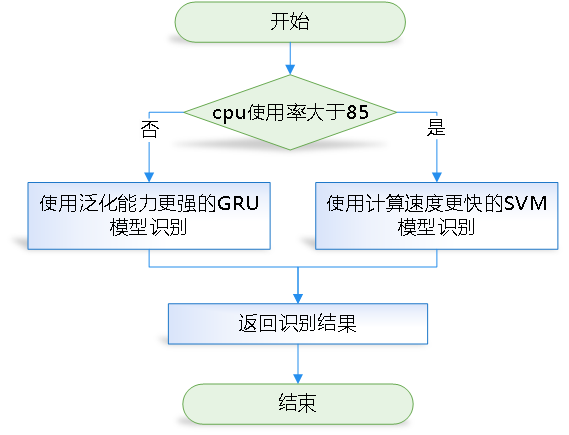

# 手机输入姿态识别
通过采集不同使用姿态下的手机重力感应器、线性加速度感应器、加速度感应器和陀螺仪的数据，得到模型的训练数据。训练出来的模型使用`fastapi`进行API发布部署，手机采集传感器数据后`post`到服务端，服务端识别出姿态后返回具体的姿态到手机端。

识别以下三种姿态:
```python
{
    0: "正常的输入操作",
    1: "输入中换人",
    2: "行走输入"
}
```
安卓手机端的数据采集项目见：[Android_Sensor_Data_Collection](https://github.com/charent/Android_Sensor_Data_Collection)


# 数据处理及模型训练
见`attitude_recognition`文件夹下的[readme.md](./attitude_recognition/readme.md)。 

训练的模型有深度学习模型`rnn_model.py`和机器学习模型`rnn_model.py`，数据处理及窗口滑动平均处理见`utils/data_process.py`。

## 采集到的数据样例


## 各模型效果


# 服务端
见`attitude_recognition_server`文件夹下的[readme.md](./attitude_recognition_server/readme.md) 
。 

api`/download_apk`和`/check_update`是更新android端版本的。

## 服务端架构
